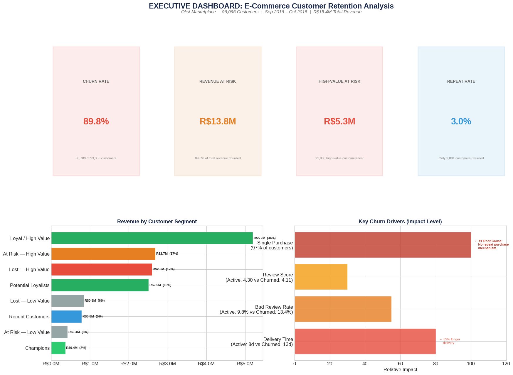
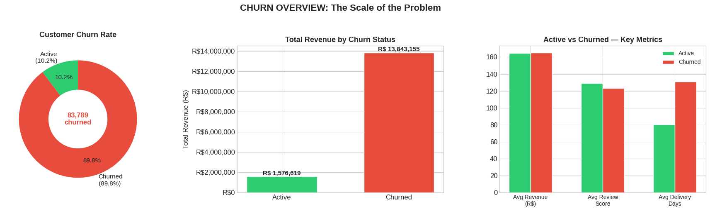
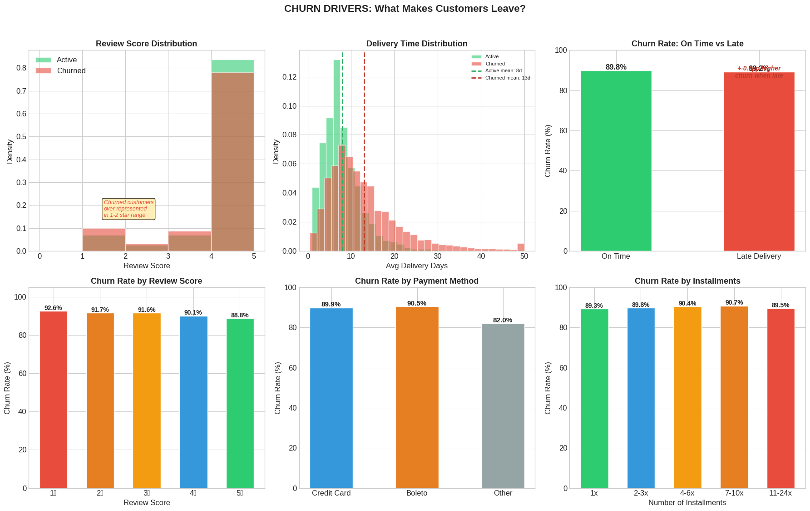
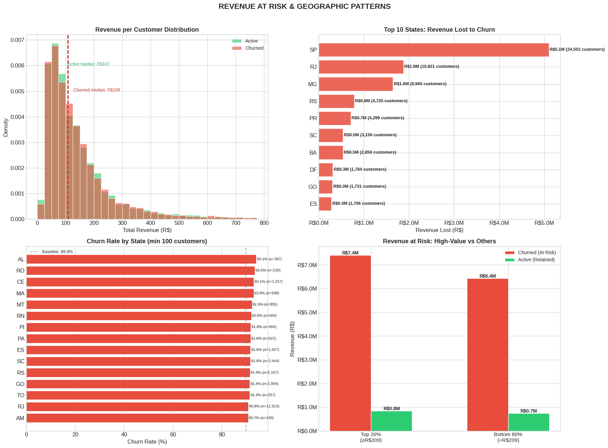
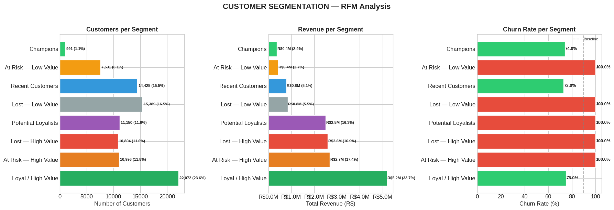

# **Identifying R$5.3M in At-Risk Revenue**
## **E-Commerce Customer Churn Prediction & Customer Lifetime Value Analysis**

[](https://www.kaggle.com/code/armandjunior/full-cycle-analysis-e-commerce-churn-prediction/)
[](https://python.org)
[](LICENSE)

---

### 🎯 Business Question
> *"Which customers are about to leave, how much revenue is at risk, and what should the marketing team do about it?"*

### 📌 Overview
Full-cycle data science project analyzing **100,000+ real e-commerce transactions** from a Brazilian marketplace (Olist). This project covers the entire analytics lifecycle: SQL engineering, data cleaning, EDA with 20+ visualizations, ML modeling, RFM customer segmentation, CLV estimation, and executive-ready business recommendations.

---

### 🔑 Key Findings

| Metric | Value |
|--------|-------|
| Churn Rate | **89.8%** (83,789 of 93,358 customers) |
| Revenue at Risk | **R$13.8M** from churned customers |
| High-Value at Risk | **R$5.3M** from 21,800 high-value churned customers |
| Repeat Purchase Rate | **3.0%** — the root cause of churn |
| #1 Churn Driver | Delivery time (Active: 8 days vs Churned: 13 days) |
| Projected Recovery | **R$1M+** from 5 recommended retention campaigns |

---

### 🛠️ Tools & Technologies

`Python` · `SQL (SQLite)` · `Pandas` · `NumPy` · `Scikit-Learn` · `XGBoost` · `LightGBM` · `Matplotlib` · `Seaborn` · `Plotly` · `Lifetimes (BG/NBD + Gamma-Gamma)`

---

### 📋 Methodology

| Phase | Description | Skills |
|-------|-------------|--------|
| 1. Data Acquisition | Loaded 9 relational tables (1.55M records) | Python, Pandas |
| 2. SQL Engineering | Analytical base table: JOINs, CTEs, Window Functions | SQL |
| 3. Data Cleaning | Missing value handling, 28 features engineered | Data wrangling |
| 4. EDA & Storytelling | 20+ visualizations with business annotations | Matplotlib, Seaborn |
| 5. ML Modeling | 4 models compared, data leakage caught & fixed | Scikit-Learn, XGBoost |
| 6. Customer Segmentation | RFM analysis with 8 actionable segments | Business analytics |
| 7. CLV Estimation | BG/NBD + Gamma-Gamma probabilistic framework | Lifetimes |
| 8. Recommendations | 5 strategies with projected ROI | Executive communication |

---

### 📊 Executive Dashboard



---

### 📈 Key Visualizations

<p float="left">
  
  
</p>
<p float="left">
  
  
</p>

---

### 💡 5 Strategic Recommendations

| # | Recommendation | Priority | Projected ROI |
|---|---------------|----------|---------------|
| 1 | "Second Purchase" Incentive Program | 🔴 CRITICAL | ~393% |
| 2 | Win-Back for At-Risk High-Value Segment | 🔴 CRITICAL | ~387% |
| 3 | Fix Delivery in High-Churn Regions | 🟡 HIGH | Long-term |
| 4 | Post-Delivery Review Recovery Program | 🟡 HIGH | Brand protection |
| 5 | VIP Loyalty for Champions & Loyal Segments | 🟢 ONGOING | ~2,700% |

**Combined projected impact: R$1M+ recovered revenue on R$525K investment (~92% ROI)**

---

### 🧠 Intellectual Honesty Highlights

- **Data Leakage Detection:** Initial models scored ROC-AUC = 1.0. Identified that `recency_days` directly encoded the churn label. Rebuilt with temporal train/test split and documented the fix.
- **CLV Model Limitation:** BG/NBD model correctly predicted near-zero CLV because 98% of customers never repeat. Pivoted to RFM segmentation — a more actionable framework for single-purchase marketplaces.

---

### 📂 Project Structure
```
ecommerce-churn-prediction-clv-analysis/
├── README.md
├── notebooks/
│   └── full_cycle_analysis.ipynb     ← Main Kaggle notebook
├── images/
│   ├── executive_dashboard.png
│   ├── churn_overview.png
│   ├── churn_drivers.png
│   ├── revenue_at_risk.png
│   ├── rfm_segmentation.png
│   ├── correlation_analysis.png
│   └── clv_analysis.png
├── data/
│   └── README.md                     ← Links to Olist dataset on Kaggle
├── requirements.txt
└── LICENSE
```

---

### 🚀 How to Run

1. **Kaggle (Recommended):** [Open the notebook directly on Kaggle](https://www.kaggle.com/code/armandjunior/full-cycle-analysis-e-commerce-churn-prediction)
2. **Local:**
```bash
git clone https://github.com/ARMAND-cod-eng/ecommerce-churn-prediction-clv-analysis.git
cd ecommerce-churn-prediction-clv-analysis
pip install -r requirements.txt
jupyter notebook notebooks/full_cycle_analysis.ipynb
```

---

### 👤 Author

**Armand Junior Dongmo Notue**
Master of Science in Data Science: Grand Canyon University

[](https://www.linkedin.com/in/notue250/)
[](https://github.com/ARMAND-cod-eng)
[](https://www.kaggle.com/armandjunior)


